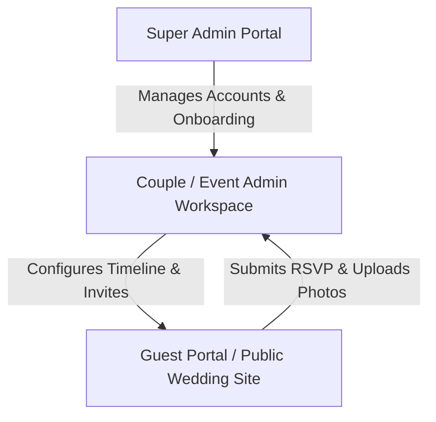

# Wedding Management System (WMS) - Comprehensive Project Manual

This manual provides an end-to-end overview of the WMS application architecture, user workflows, user interfaces, database schema, and technical details. You can present this document to clients or stakeholders to explain how the entire ecosystem works.

---

## 1. Project Overview & Ecosystem

The WMS is a multi-tenant platform designed to manage wedding celebrations, timelines, guest invitations, photo sharing, and RSVPs. The ecosystem consists of three key user portals:

### Core Technologies
*   **Frontend**: Next.js / React (Vite Single-Page Application client), TailwindCSS, Shadcn-style custom UI.
*   **Backend**: Node.js, Express.js.
*   **Database**: Turso SQLite (libSQL client) managed via Drizzle ORM.
*   **Realtime**: Socket.io for live updates.
*   **Storage**: Cloudinary Integration for hosting dynamic PDF invitations, guest portal banners, and gallery photos.

---

## 2. Roles and Permissions Matrix

The WMS features a strict Role-Based Access Control (RBAC) mechanism to isolate data and actions:

| Role | Scope | Key Capabilities |
| :--- | :--- | :--- |
| **Super Admin** | Platform-Wide | Creates/edits Couple accounts, manages subscription plans, configures host groups (Bride/Groom side names), reviews platform-wide logs. |
| **Couple Admin (HOST_A)** | Single Account (Bride Side) | Manages Bride-side guest lists, designs wedding invitations, reviews Bride RSVP responses, sends invitation deep links. |
| **Couple Admin (HOST_B)** | Single Account (Groom Side) | Manages Groom-side guest lists, designs wedding invitations, reviews Groom RSVP responses, sends invitation deep links. |
| **Guests (Public)** | Public Link / Slug | RSVP submissions, photo gallery access, viewing event itineraries, uploading images, sending wishes. |

---

## 3. End-to-End User Workflows

### Phase 1: Onboarding (Super Admin)
1.  **Login**: Super Admin logs in using platform credentials.
2.  **Couple Creation**: Fills the couple registration form specifying:
    *   Bride and Groom details (names, contact numbers, usernames).
    *   Custom Host Group Names (e.g. *Bride Family* / *Groom Family* or *Host Side* / *Co-Host*).
    *   Unified dashboard access password.
3.  **URL Generation**: WMS generates a slug-based public domain URL (e.g., `/invite/sam-rhea`).

### Phase 2: Configuration & Planning (Event / Couple Admins)
1.  **Dashboard Login**: The bride or groom administrator logs in. The dashboard dynamically adjusts its options based on their logged-in `hostGroup` context.
2.  **Sub-Event Timeline Configuration**:
    *   Configure individual timeline events (e.g. *Haldi, Sangeet, Wedding, Reception*).
    *   Set date, venue, dress code, maps coordinates, and select native event start times via a native time clock.
3.  **Invitation Templates**:
    *   Upload PDF template cards for **Sahjode** (Couple invitations) and **Sarva** (Family invitations).
4.  **Guest Directory Management**:
    *   Add guests individually or bulk-import via CSV.
    *   Specify mobile number, invitation category (Sahjode or Sarva), and select specific sub-events they are invited to.
5.  **RSVP Form Builder**:
    *   Build custom forms with questions (e.g., "Do you require hotel accommodation? Food preference?").

### Phase 3: Message Scheduling & Invitation Delivery
1.  **Template Management**:
    *   Create reusable message templates (e.g. *Welcome Invitation, Sangeet Reminder*).
    *   Insert placeholder brackets like `{{guestName}}`, `{{eventName}}`, `{{venueName}}`, `{{eventTime}}`, `{{guestPortal}}`.
2.  **Scheduling Notification Queues**:
    *   Schedule messages to be dispatched at a precise date and time.
3.  **Background Pipeline Processing**:
    *   A continuous 10-second scheduler cron checks for pending tasks.
    *   Resolves target guest variables and maps the correct PDF card, maps link, and guest-portal login deep-link.
    *   Generates a WhatsApp `wa.me` deep-link queue.
4.  **Dispatched Delivery**:
    *   Couple Admin clicks "Send Queue" to trigger prefilled WhatsApp windows. The delivery is saved in the Audit Logs.

### Phase 4: RSVPs & Interactive Guest Experience
1.  **Guest Access**: Guest receives a WhatsApp message containing their unique magic login link.
2.  **RSVP Submission**: Guest selects which sub-events they are attending, inputs guest count, and answers custom questions. Data is recorded instantly in the backend.
3.  **Timeline & Maps Navigation**: Guest views event date, time, venue address, and launches the Google Maps redirect.
4.  **Wishes & Gallery**:
    *   Guests leave digital wishes shown on the homepage.
    *   Guests upload photos taken during the ceremonies. Photos remain private/approved under Couple Admin moderation.

---

## 4. Technical File & Database Structure

### Core Repository Files
*   [`schema.js`](file:///d:/asttrix/MMS/server/src/database/schema.js): Database table schemas (Couples, Guests, Events, MessageTemplates, Notifications, AuditLogs).
*   [`couple.js`](file:///d:/asttrix/MMS/server/src/routes/couple.js): REST APIs managing timelines, guests, custom fields, and WhatsApp url compilers.
*   [`cronService.js`](file:///d:/asttrix/MMS/server/src/services/cronService.js): Backend scheduler processing notification timers.
*   [`Guests.jsx`](file:///d:/asttrix/MMS/client/src/pages/CoupleDashboard/Guests.jsx): Interactive guest management panel.
*   [`Notifications.jsx`](file:///d:/asttrix/MMS/client/src/pages/CoupleDashboard/Notifications.jsx): Message scheduling, templates, and invitation queues.

---

## 5. Security & Isolation Architecture

*   **Tenant Separation**: Every database query verifies `coupleId` to prevent couples from viewing other weddings' details.
*   **Host Group Separation**: Couple logins are mapped to a specific `hostGroup` session. Guests and template entries are isolated to ensure the bride's side does not modify the groom's side information.
*   **JWT Handshakes**: Communication between frontend and backend is signed using JSON Web Tokens containing current role scopes.
